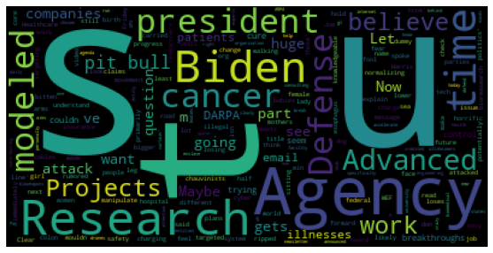
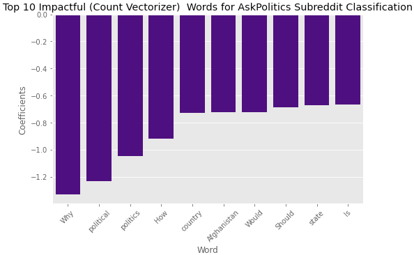

# 

## Social Media Communication Exploration
### Target Clientele: Local Maine Political Candidates

---

## Contents
- Introduction
    - Data Collection
    - Data Cleaning and EDA Overview
- Modeling Overview
- Conclusions
- Recommendations

---

## **Introduction**
#### **Bit of Background**
Online sources of political media has become essential to the exchange of political content on platforms especially among major social media platforms such as Facebook, Twitter, and even Subreddit.
Serra Public Affairs hopes to begin gaining traction with a new clientele base for local political candidates in Maine.
# 

For the purposes of my project, the social media platform selected was Reddit and to begin analyzing what the varied discussion language between both I decided to create a classification model. This was an effort to begin understand what kind of communication can be classified as political discourse versus conspiracy discussions. The project is to meet a potential need of communications groups of campaigns so ultimately a piece of text could be predicted to could be classified as a Conspiracy post informing these liaisons if this text should be altered.

The reasoning between these subreddits came from experience as a phone banker in the US 2020 election where thousands of calls were made and a large amount of these calls from both parties were concerned with not only the presence of fake news in their news outlets and peer discussion but also from what they thought to be candidates messaging.

So in order for any modern day politician having clear and **trustworthy communication** through their social media platforms will be essential in the era of fake news.

The subreddits, Conspiracy, was selected based on their lengthy and active participation and the notorious reputation for contributing to the spread of misinformation [Reference](https://arxiv.org/abs/1705.06947).
Another goal of the project is to determine the most impactful words that are important when classifying a text as a political or conspiracy post based on its' language to inform communication liaisons.

#### **Data Collection and Cleaning**

# 

The first stage of the project was to collect posts from each Subreddt, to do this I utilized Reddits Pushshift API it was a fairly simple process utilizing the requests library to gather a .JSON file to work with and extract necessary information. A sleep function was included as to not overwhelm the server.

The cleaning process included various forms of removing nulls, urls, and punctuation characters. A few features were extracted from the text content to potentially improve model performance, discussed more in the Logistic Regression notebook.

**Preprocessing and Modeling**
For the purposes of the project two vectorizers were utilized and a couple of models were compared, Random Forest and Logistic Regression. however ultimately the model of interest was Logistic Regression because we could explore the most impactful words with this model results. However it is important to note that there are a variety of vectorizers and models to be explored in future steps for this project. These will be included and updated as time permits in the following weeks.

**Model Evaluation and Basic Cleaning Results to Note**

When initially beginning this project the metrics of interest and evaluation methods were considered and the most appropriate metric appeared to be accuracy as well as consideration of misclassification percentages through confusion matrix examinations. Since the purpose of the project was to distinguish between two forms of communication no other metrics truly called to be extremely applicable other than accuracy. As a result of our data extraction and cleaning we ended up with a fairly balanced class of approximately 50% per subreddit.

---
Conclusion

Ultimately we are able to get a sense of what type of words to avoid there are various ways to build up this models capabilities that can be explored further but the conclusion can be made that there is a difference between political and conspiracy discourse. A more in depth sentiment analysis will likely be helpful for future politically centered clients.

However for the preliminary exploration and purpose of this project, differentiating text between conspiracy and political discourse can be made from our final model. 
       

Additional notes can be made from the model created we can see that there are some topics to be avoided such to have a more strengthening message to the general public. There are topics to address shown in our examination of top 25 words throughout our model iterations, where in our political discourse hot topics were those that contained 'Ukraine'. Another conclusion can be made for the events occurring in Afghanistan where these are frequent topics of discussion that appeared in our final examination process.

---
Future Recommendation's

More work could be done to improve this model however with the rise in fake news a very essential objective of any modern day political candidate would need to consider how they will not only improve their communications to improve their connections with the general public they hope to represent, but additional resources should be allocated to explore how we as a marketing strategy group could address this rising issue. So my recommendation is to look at the larger social media platforms and attempt to create a predictive model that campaign communications managers could utilize to gauge what audience their messaging appeals to or follows.
